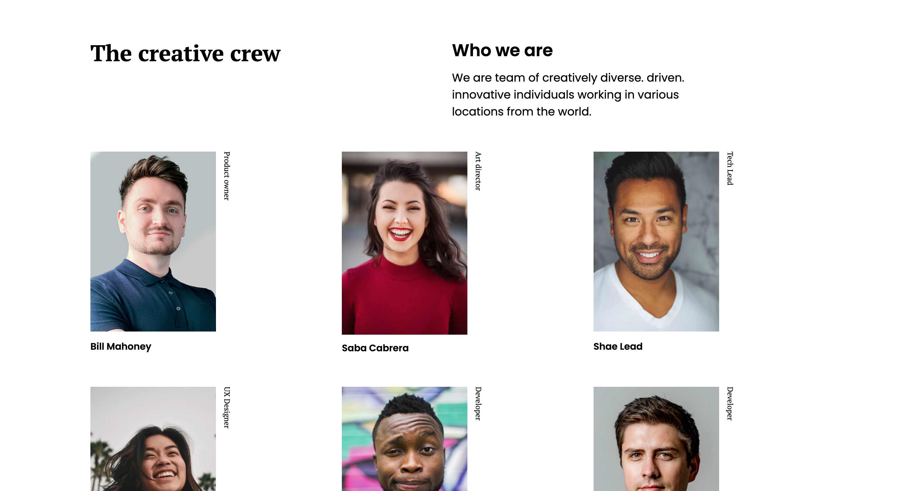

<h1 align="center">The Creative Crew</h1>

   Solution for a challenge from  <a href="http://devchallenges.io" target="_blank">Devchallenges.io</a>.

  <h3>
    <a href="https://dc-my-team-page-brnn.vercel.app/">
      Demo
    </a>
     | 
    <a href="[https://github.com/arunpariyar/dc-my-team-page]">
      Solution
    </a>
     | 
    <a href="https://devchallenges.io/challenges/hhmesazsqgKXrTkYkt0U">
      Challenge
    </a>
  </h3>

<!-- TABLE OF CONTENTS -->

<!-- OVERVIEW -->

## Overview

This is the team page for a fictional team that was built with vanilla css and sass.

### Acknowledgement

<!-- This section should list any major frameworks that you built your project using. Here are a few examples.-->

<!-- List the features of your application or follow the template. Don't share the figma file here :) -->

This application/site was created as a submission to a [DevChallenges](https://devchallenges.io/challenges) challenge. The [challenge](https://devchallenges.io/challenges/hhmesazsqgKXrTkYkt0U) was to build an application to complete the given user stories.
